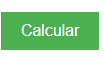
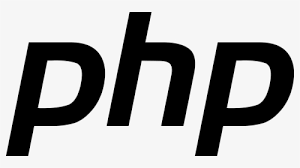

[Projeto - Sequência de Fibonacci](#projeto---sequ%C3%AAncia-de-fibonacci)

[Descrição](#descri%C3%A7%C3%A3o)

[Introdução](#introdu%C3%A7%C3%A3o)

[Funcionalidades](#funcionalidades)

[Tecnologias Utilidadas](#tecnologias-utilizadas)

[Fontes Consultadas](#fontes-consultadas)

[Autores](#autores)

# Projeto - Sequência de Fibonacci

## Descrição:
Este código cria um formulário HTML onde o usuário pode inserir um número. Quando o formulário é enviado, o PHP calcula a soma dos números da sequência de Fibonacci até esse número e exibe o resultado abaixo do formulário.
## Introdução:
Você já ouviu falar na sequência de Fibonacci? Ela é uma sequência de números em que cada número subsequente é a soma dos dois anteriores. Começando com 0 e 1, os primeiros números da sequência são 0, 1, 1, 2, 3, 5, 8, 13 e assim por diante. Este padrão infinito é frequentemente encontrado na natureza e tem várias aplicações em matemática e ciência.

Aqui, você pode inserir um número e calcular a soma de todos os números da sequência de Fibonacci até esse número. Basta preencher o campo abaixo e clicar em "Calcular" para ver o resultado!
## Funcionalidades:

- `Calcular`: Após o usuário inserir um número na caixa de resposta, haverá um botão para calcular a soma dos números da sequência de Fibonacci até número escolhido.
 
 
## Tecnologias Utilizadas:

As tecnólogias utilizadas para a criação foram..

🔧HTML🔧

🔧CSS🔧

🔧GitHub🔧

🔧Visual Studio Code🔧

🔧PHP🔧

## Fontes Consultadas:

[Toda Matéria](https://www.todamateria.com.br/sequencia-de-fibonacci/#:~:text=1%2C%201%2C%202%2C%203,de%20uma%20popula%C3%A7%C3%A3o%20desses%20animais.) - Sequência de Fibonacci

## Autores:
Thalyta das Neves Ferreira 3°A
